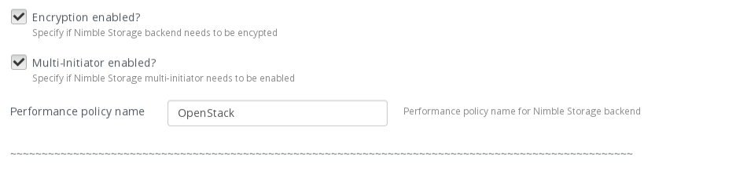

=========================
Configuring Nimble plugin
=========================

Once the Nimble Fuel plugin for Cinder has been installed, you can create OpenStack environments that use Nimble storage. 
The plugin will provide the configurable and extra-spec options for a Cinder backend deployment.

#. Create an OpenStack environment using the Fuel UI wizard and enable the Nimble Fuel Plugin:

   .. image:: _static/nimble_enable_plugin_deploy.png
      :width: 90%

#. Finish environment creation.

#. Once the environment is created, open the **Settings** tab 
   and then select **Storage**. Scroll down the page. Ensure the **Cinder plugin for Nimble Storage**
   checkbox is selected:

   .. image:: _static/nimble_storage_plugin_checkbox.png
      :width: 90%

#. Select the number of Nimble Cinder backends to configure.

   .. image:: _static/nimble_storage_plugin_nbr_backends.png
      :width: 90%

#. **Optional** - Select the **Group all backends** check box if all configured backends use the same volume backend name.
      * If the cinder backends are to be used as the same volume_backend_name, populate the Group Backend Name and Group Volume Type text box accordingly.   
      * Follow Instructions listed later for the selection of the cinder.conf paramters and extra-specs listed below the Group Volume Type text box.

   .. image:: _static/nimble_storage_plugin_group_backends.png
      :width: 90%

#. Specify the following cinder.conf parameters when defining a Cinder backend for Nimble Storage.
     - Cinder Service Name: Defines the Cinder service and title of stanza for backend within cinder.conf
     - Backend Name: Defines the Cinder volume_backend_name
     - Volume Type Name(Optional): Defines the volume type associated with this backend
     - Set as Default Volume Type(Optional): Select the check box if this Volume Type will be the Cinder Default Volume Type
     - Select the appropriate Nimble Cinder driver and protocol
     - The hostname or IP address of the Nimble Storage Management IP
     - The User ID for the Nimble Storage array
     - The Password for the User ID
     - Nimble Subnet Label(Optional): Defines the Nimble Array subnet label for the iSCSI Data Path if more than one
     - Pool Name(Optional): Defines the Nimble Storage Pool Name, if mre than one. Left blank will use the default pool name
     - Multipath for Image Transfer(Optional): To attach/detach volumes in Cinder using multipath for volume to image and image to volume transfers

   - Those parameters listed as ``Optional`` will use the default values for Cinder and/or Nimble Storage

   .. image:: _static/nimble_storage_plugin_cinder_parameters.png
      :width: 90%

   
#. Specify the following extra-specs key values as required

* Encryption Enabled (Optional): Check box to enable encryption for the Cinder Volume Type on the Nimble Array. The array must have Encryption enabled
* Multi-initiator enabled (Optional): Check box to specify if the Nimble Storage multi-initiator feature should be enabled for this volume type 
* Performance Policy Name (Optional): Performance Policy name for the Cinder Volume Type. Left blank will use Nimble Default

      
     
#. Repeat the population of the configurable parameters and extra-specs for each Backend desired.

#. Save your changes and continue to deploy OpenStack with Fuel

Nimble Fuel Plugin information
==============================
* The Nimble Fuel Plugin is defined as a hot-pluggable Fuel plugin. Thus, additional Cinder backends can be deployed after the initial OpenStack deployment with Fuel
* The Nimble Fuel Plugin can deploy up to 5 cinder backends in a single deployment 

Release Notes
=============
* Version 1.0.0 supports Fuel 9.x.

Nimble Cinder Driver Documentation
==================================
For more information on the configuration options for the Nimble Cinder driver made available with the Fuel Plugin, please see `Cinder Nimble Driver configuration <http://docs.openstack.org/mitaka/config-reference/block-storage/drivers/nimble-volume-driver.html>`_

